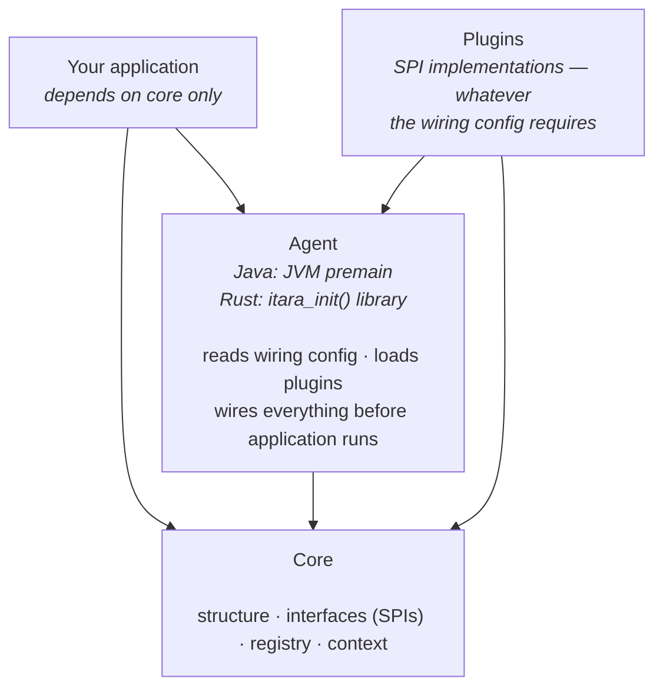
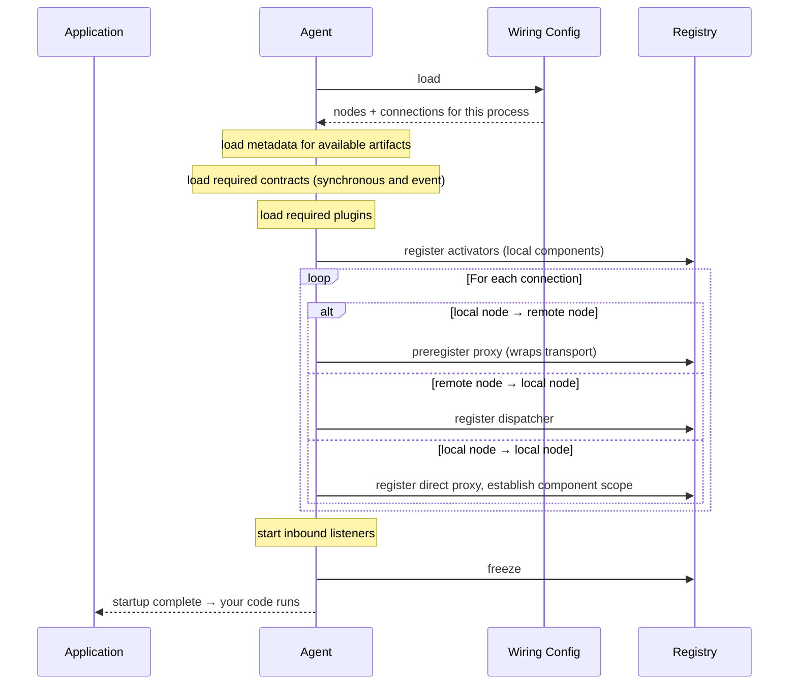
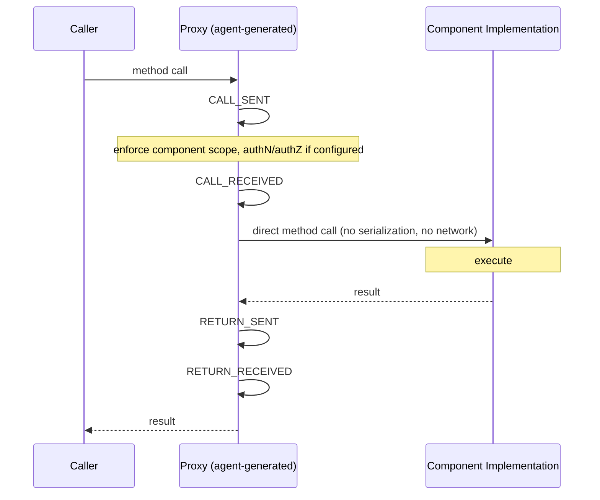
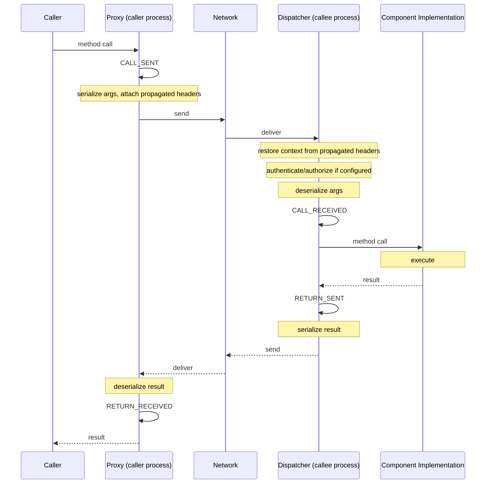

 
This page describes how Itara actually works today — the module
structure, the layering rules, what happens at startup, and what happens
on a call. For where this is going, see [Vision](/docs/explanation/vision/). For the
formal, normative behavior every implementation must satisfy, see the
[wiring configuration](/docs/reference/wiring-configuration/) and
[metadata format](/docs/reference/metadata-format/) references.
 
---
 
## The core idea, in one paragraph
 
The Itara agent runs before application code. It reads a wiring config,
loads the plugins that config actually requires, generates proxies and
listeners for each declared connection, and registers everything in the
component registry — before the application handles its first request.
By the time your entry point executes, the topology is fully wired.
Component code calls other components through plain interface
references and never knows whether the call goes in-process or across a
network — or which language the other component is written in. The
specification itself is language-neutral: a Java component and a Rust
component can participate in the same topology, wired by the same
config, producing a single distributed trace.
 
---
 
## Layers
 
Itara has four layers. The dependency rule is strict: lower layers know
nothing about upper layers. All arrows point downward.
 
- **Your application** — calls components via interfaces, depends on core only
- **Plugins** — SPI implementations, pulled in based on whatever the
  wiring config actually requires
- **Agent** — reads config, loads plugins, wires everything before
  application runs
- **Core** — the structure and interfaces (SPIs) everything else builds
  on, plus the registry and context

 
---
 
## Key concepts
 
**Contract** — the interface a component exposes to its callers. Says
what the component does, not how. Declares operations — inputs, outputs,
errors — with no reference to transport, serialization, or deployment.
Callers depend only on the contract; the implementation behind it, and
the topology, are both invisible to them.
 
**Component** — a unit of business logic: a contract, a concrete
implementation satisfying it, and an activator that wires it at startup,
together. Component code has no knowledge of transport, topology, or
deployment — it doesn't know whether it's being called locally or
remotely, by one caller or many. Components are the fixed units of the
system; they don't split or merge, only their placement in a topology
changes.
 
**Activator** — instantiates the component. The single composition root
per component. Component code itself never touches the registry directly —
only the activator does, and only at startup.
 
**Node** — a deployment identity. Declared in the wiring config with an id
and a component. One component can run as multiple nodes with different
topologies. How many instances of a node are running is the orchestrator's
concern — not Itara's.
 
**Master wiring config** — a single YAML file describing the complete
topology. Each process reads the same file and self-selects its relevant
slice based on which nodes it is responsible for. One source of truth. See
the [wiring configuration reference](/docs/reference/wiring-configuration/)
for the full format.
 
---
 
## Startup sequence
 
Before application code runs:
 

 
The invariant: by the time the application logic runs, the
topology is fully wired, validated, and every inbound listener is
started. Topology errors surface at startup with clear messages — never
at call time.
 
---
 
## Request flow
 
### Direct call (same process)
 
In a direct connection, the caller holds a reference to a proxy. The
proxy fires observability events and calls the implementation directly —
nothing that isn't strictly necessary for the call itself. No
serialization, no network. The proxy is what makes observability
structural: there is no other path to the implementation.
 

 
No serialization. No network. The component implementation is unaware of
the proxy — it just executes. The four events are structural properties
of the platform that cannot be removed, whether the connection is
colocated or remote.
 
### Remote call (separate processes)
 

 
The specific wire format — HTTP verbs and URLs, a Kafka topic and
partition, or anything else — is entirely up to the transport
implementation. Nothing about how a call crosses a process boundary is
architecturally fixed except the four events firing at the topology
boundary on each side, and whatever headers get attached along the way.
 
---
 
## Observability event model
 
Every component interaction — direct or remote, Java or Rust — emits four
events, firing precisely at the boundary between the business layer and
the topology layer:
 
| Event | Side | Fires |
|-------|------|-------|
| `CALL_SENT` | Caller proxy | Business layer hands off to topology layer |
| `CALL_RECEIVED` | Callee dispatcher | Topology layer hands off to business layer |
| `RETURN_SENT` | Callee dispatcher | Business layer hands the result back to topology layer |
| `RETURN_RECEIVED` | Caller proxy | Topology layer hands the result back to business layer |
 
This placement — at the layer boundary, not tied to any particular
mechanism like serialization — is what makes topology overhead measurable
regardless of transport. Everything between `CALL_SENT` and
`CALL_RECEIVED` is topology cost, by construction: serialization, network
transit, deserialization for a remote call; nothing at all for a direct
one. This gives:
 
- **Caller span** (`CALL_SENT` → `RETURN_RECEIVED`): full round trip
  including whatever the topology layer did on both sides
- **Callee span** (`CALL_RECEIVED` → `RETURN_SENT`): pure component
  processing time, independent of transport entirely
- **Serialization and network cost**: whatever's left — the gap between
  the two spans

Plugins can add their own custom spans for their own diagnostic detail.
The four structural events are different: only the proxy and dispatcher
ever emit them. A plugin can add detail alongside them, never in place of
them.
 
---
 
## Boundary enforcement
 
Components never call each other directly — not even when colocated in
the same process. Each has its own scope. The only path between two
components is a proxy the agent prepared from the wiring config, and that
holds identically whether the connection is direct or remote. Colocating
two components for performance is a placement decision; it never implies
they can reach each other without something declared between them.
 
---
 
## The SPI pattern
 
All plugin kinds follow the same discovery pattern, in every language —
the specific kinds extend over time, the mechanism does not:
 
- Each artifact ships a `.itara` metadata file declaring its kind, id,
  version, and capabilities.
- The agent reads all metadata files before loading any artifact —
  validation happens before execution.
- The agent loads only what the wiring config requires.
- Loaded implementations register with their respective SPI registry in
  core.

A component author never needs to know which plugins, if any, a given
connection uses; that knowledge lives entirely in the wiring config.
 
---
 
## Hard constraints
 
These are not guidelines — they are architectural invariants:
 
- **Core has no external dependencies.** If a proposed change requires
  adding a dependency to core, the design is wrong.
- **Application code depends on core only.** It never depends on the
  agent or any plugin directly.
- **Plugins never import each other.** They are connected by the agent,
  not by depending on one another.
- **No topology decisions at call time.** Proxies, listeners, and
  dispatchers are resolved at startup. Nothing is looked up during
  request handling.
- **Observability is fired by the proxy/dispatcher layer, not by
  plugins.** A plugin can add detail; it cannot replace the structural
  events or decide not to fire them.
- **Colocation is a placement decision, not a trust decision.** Nothing
  about how two components reach each other changes based on whether
  they share a process.
- **Direct calls add nothing beyond what's strictly necessary for the
  call itself.** No serialization, no network — that's the whole
  guarantee; it isn't a claim that literally nothing else can ever run on
  that path.
 